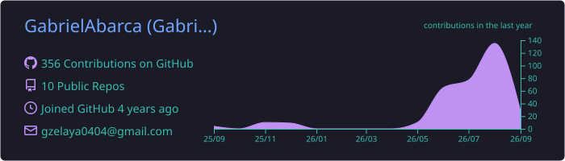
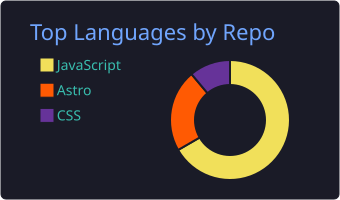
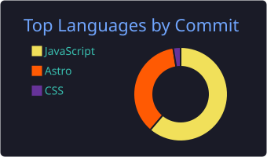

  

 

  
  &nbsp;
  
  &nbsp;
  

 

  

---

## `$ whoami`

Hi there! 👋 I'm Gabe
I'm a CS student and self-taught front-end developer who's been building real products for many years before starting formal education. My recent work includes a full-stack webapp school management system (Dashboard), personal portfolio using a personalized domain, and a Rust programming course currently in development.

---

### Let's Connect

If you like my way of thinking and ability to code, don't hesitate to reach out!
You can visit my personal website → **[gzelaya.com](https://gzelaya.com)** *(contact form available!)*

- 🌐 Live portfolio → **[gzelaya.com](https://gzelaya.com)**
- 🦀 Currently building a **Rust programming course** for experienced devs!
- 🗄️ Working on a **Node.js + PostgreSQL school management system** (Supabase)
- 🎸 I also play the guitar🙂 (*Every dev has a hobby that gets them away from the computer, right?*)

---

## 🛠 Tech Stack

**Languages**

**Frameworks & Libraries**

**Tools & Platforms**

---

## 📊 GitHub Stats

  

  
  &nbsp;&nbsp;
  

  

---

## 🚀 Featured Projects

### [Simple Manage Pro](https://simplemanagepro.com)

Full-stack school management dashboard — landing page &amp; product site.

  

---

## 🐍 Contribution Activity

  <picture>
    <source media="(prefers-color-scheme: dark)" srcset="https://raw.githubusercontent.com/GabrielAbarca/GabrielAbarca/output/github-contribution-grid-snake-dark.svg">
    <source media="(prefers-color-scheme: light)" srcset="https://raw.githubusercontent.com/GabrielAbarca/GabrielAbarca/output/github-contribution-grid-snake.svg">
    
  </picture>

---

  

